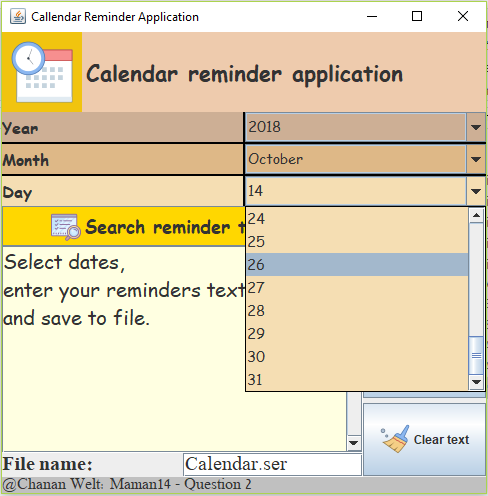
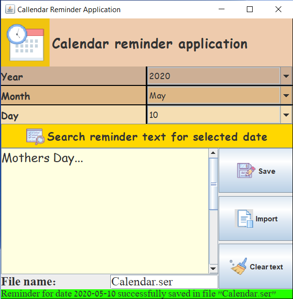
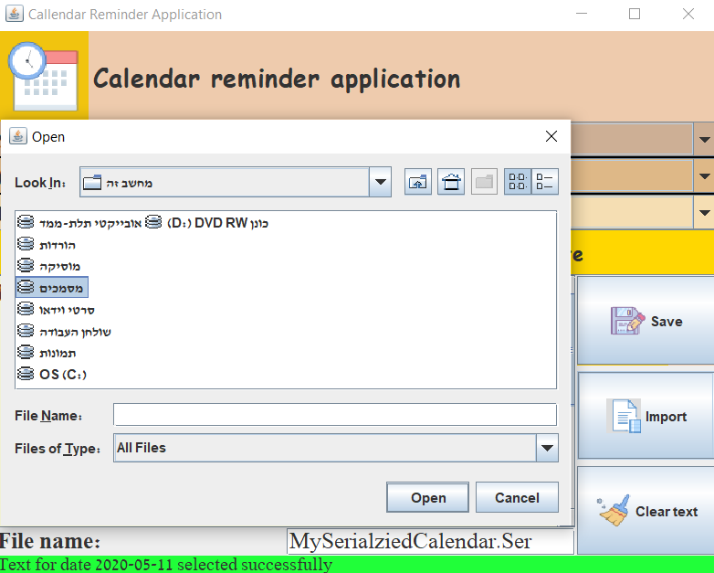

# Java-MVC-UI-Desktop-Calendar-Reminder-application   

# Description 
Java Swing MVC-UI desktop callendar-reminder :calendar: application, which lets the user to insert remarks and reminders on desired dates, saving data to file via serialization, and uploading the data later to view it. 

## Usage 
Inorder to run the app, you could just run the "run.bat" script :page_with_curl:.
Select desired dates :date:, save reminders, and then you could upload them later and display them. 

## Screenshots 
### Initial Screen 

### Saving a Reminder  

### Importing Previously Serialized Calendar.png  

